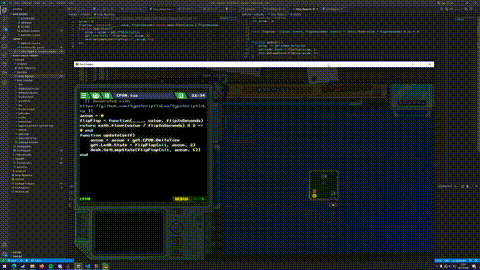
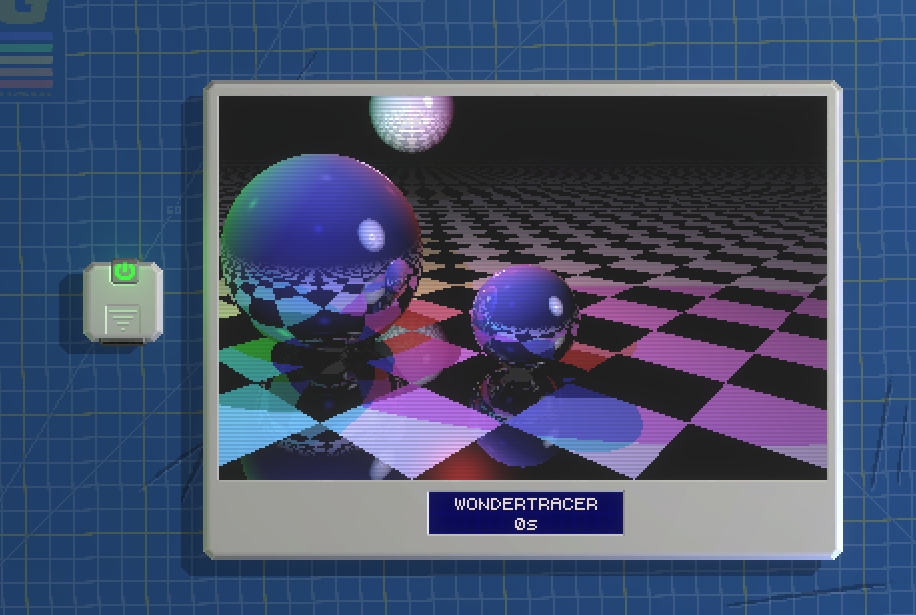

# Typescript To Lua type definitions and helpers

These are type definitions for the game Retro Gadgets, found on Steam here:
https://store.steampowered.com/app/1730260/Retro_Gadgets/

Defines the API found at https://docs.retrogadgets.game/api/index.html

## Todo:

- Add docstrings
- scrape doc pages for typedef generation
- adding typedefs for missing APIs (for example `gdt: Gadget`)
- generator/descriptor for gadgets (CPU0, CPU1, CPU2 ...)
- generators for keypad and similar m*n constructs

## Examples

  
`examples/lamp-flipper.ts` switches the lamp every 5 seconds on/off and an LED every 2 seconds

  
`examples/binary-clock.ts` shows a simple counter that slowly counts to 256 and resets

  
`examples/raytracer.ts` is a port of the TypeScript example raytracer

