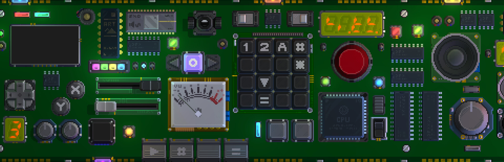

# Retro Gadgets TypeScript declarations

---

TypeScript declarations for [Retro Gadgets][1], a video game about building small electronics.

Checkout the [template project][2] or the [example repository][3].

## Special Thanks

- [@Perryvw][4] for his outstanding patience
- [@Dreagonmon][5] for good feedback and PRs
- [@NexTre-dev][6] for fixes and corrections

[1]: https://store.steampowered.com/app/1730260/Retro_Gadgets/
[2]: https://github.com/DarkMio/retro-gadgets-template
[3]: https://github.com/DarkMio/retro-gadgets-examples
[4]: https://github.com/Perryvw
[5]: https://github.com/Dreagonmon
[6]: https://github.com/NexTre-dev